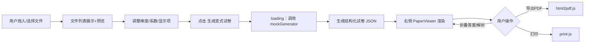

# 试卷变式机 — 前端设计方案（Vue + JS + HTML）

> 独立的纯前端工具，与当前仓库其他项目无关。无后端依赖，所有逻辑、解析、渲染均在浏览器内完成；"生成变式"环节通过本地 Mock / 规则引擎产出示例数据（如需 AI，后续再外接 API）。

---

## 1. 产品定位

一款 Web 端"试卷变式生成器"：
- 教师 / 学生上传原始试卷（PDF / Word / 图片，多文件）
- 设定 **变式难度（1–10）** 与 **变式系数（0–6，知识点相关度，越高越发散）**
- 选择是否显示 **答案 / 解析**
- 一键生成 → 右侧主区域展示新的变式试卷
- 支持复杂数学公式（KaTeX）与简易图表（Mermaid / ECharts）

设计风格：**简洁、大气、留白充足、卡片化**，主色建议墨蓝 `#2A5CAA`，辅助灰 `#F5F7FA`。

---

## 2. 技术栈（纯前端）

| 关注点 | 选型 |
|---|---|
| 框架 | Vue 3 + Vite（JS，不引入 TS 以简化） |
| UI 库 | Element Plus |
| 状态管理 | Pinia |
| 数学公式 | KaTeX + markdown-it + markdown-it-katex |
| Markdown | markdown-it |
| 图表 | ECharts（数据图）+ Mermaid（流程/几何示意） |
| 文件预览 | pdfjs-dist（PDF）、mammoth（docx→html）、原生 img |
| 导出 | html2pdf.js、print-js |
| 图标 | @element-plus/icons-vue |

> 全部为浏览器端库，无需任何后端服务即可运行。

---

## 3. 页面布局

```
┌──────────────────────────────────────────────────────────────┐
│ Header：📝 试卷变式机   · 帮助 · GitHub                       │
├──────────────────┬───────────────────────────────────────────┤
│ 左侧控制面板      │ 右侧试卷展示区                              │
│ width: 340px     │ flex: 1                                   │
│                  │ Toolbar：缩放 ｜ 导出PDF ｜ 打印 ｜ 复制     │
│ [上传区]          │ ┌──────────────────────────────────────┐  │
│  拖拽 / 多选      │ │ 试卷标题 + 元信息                      │  │
│  文件列表 + 删除   │ │ 一、选择题                            │  │
│                  │ │ 1. 设 f(x)=∫₀ˣ e^{-t²}dt …          │  │
│ 变式难度 [1-10]  │ │    A. … B. … C. … D. …               │  │
│ ────●─────  6   │ │   ▸ 答案 / ▸ 解析（可折叠）            │  │
│                  │ │ 2. 如图所示：[Mermaid/ECharts]        │  │
│ 变式系数 [0-6]   │ │ …                                    │  │
│ ──●───────  1   │ └──────────────────────────────────────┘  │
│                  │                                           │
│ ☑ 显示答案        │                                           │
│ ☑ 显示解析        │                                           │
│                  │                                           │
│ [ 生成变式试卷 ]  │                                           │
└──────────────────┴───────────────────────────────────────────┘
```

CSS Grid：`grid-template-columns: 340px 1fr;` ；<1024px 时左侧改为抽屉。

---

## 4. 目录结构

```
exam-variator/
├─ index.html
├─ vite.config.js
├─ package.json
└─ src/
   ├─ main.js
   ├─ App.vue
   ├─ styles/
   │  ├─ variables.css
   │  └─ global.css
   ├─ store/
   │  └─ paper.js              # Pinia：files / difficulty / coefficient / showAnswer / showAnalysis / paper
   ├─ components/
   │  ├─ AppHeader.vue
   │  ├─ left/
   │  │  ├─ UploadPanel.vue
   │  │  ├─ DifficultySlider.vue
   │  │  ├─ VariationCoefficient.vue
   │  │  ├─ DisplayOptions.vue
   │  │  └─ GenerateButton.vue
   │  └─ right/
   │     ├─ PaperToolbar.vue
   │     ├─ PaperViewer.vue
   │     ├─ QuestionItem.vue
   │     ├─ MathBlock.vue       # 基于 KaTeX
   │     ├─ MermaidBlock.vue
   │     └─ EChartBlock.vue
   ├─ utils/
   │  ├─ markdown.js            # markdown-it + katex 插件
   │  ├─ fileParser.js          # PDF / DOCX / 图片解析
   │  └─ mockGenerator.js       # 本地"变式"算法（占位）
   └─ assets/
      └─ sample.json            # 示例试卷数据
```

---

## 5. 核心交互流程



---

## 6. 数据契约（前端内部）

```json
{
  "title": "高三数学变式试卷（难度6 / 系数2）",
  "meta": { "difficulty": 6, "coefficient": 2, "createdAt": "2026-06-03 10:00" },
  "sections": [
    {
      "name": "一、选择题",
      "questions": [
        {
          "id": "q1",
          "stem": "设 $f(x)=\\int_0^x e^{-t^2}\\,dt$，则 $f'(x)=$ ?",
          "options": ["$e^{-x^2}$", "$2x e^{-x^2}$", "$-e^{-x^2}$", "$0$"],
          "answer": "A",
          "analysis": "由微积分基本定理，$\\frac{d}{dx}\\int_0^x g(t)\\,dt = g(x)$。",
          "chart": null
        },
        {
          "id": "q2",
          "stem": "函数 $y=\\sin x$ 在 $[0,2\\pi]$ 的图像如下：",
          "chart": { "type": "echarts", "spec": {} },
          "answer": "略",
          "analysis": "..."
        }
      ]
    }
  ]
}
```

题干、选项、解析均为 **Markdown + LaTeX**，由 `markdown-it + katex` 统一渲染。

---

## 7. 关键实现要点

### 7.1 文件上传（UploadPanel.vue）
- `el-upload` 设 `multiple drag :auto-upload="false"`
- `accept=".pdf,.doc,.docx,.png,.jpg,.jpeg"`
- 大小限制 20MB / 个，超限给 Toast
- 文件列表：图标 + 文件名 + 大小 + 删除按钮；图片显示缩略图

### 7.2 变式难度（1–10）
- `el-slider :min="1" :max="10" :step="1" show-stops show-input`
- 文案："1 = 与原题难度一致，10 = 大幅提升"

### 7.3 变式系数（0–6） ★关键概念
- `el-slider :min="0" :max="6" :step="1"` + 悬浮 Tooltip 解释：
  - **0**：与原题完全同知识点、同题型（最贴近）
  - **3**：在相邻知识点上扩展
  - **6**：跨多个相关知识点的综合发散题
- 滑块下方实时显示语义化标签：紧贴 / 接近 / 关联 / 拓展 / 综合 / 发散

### 7.4 显示选项
- 两个 `el-checkbox`：`显示答案`、`显示解析`
- 直接绑定 Pinia store；右侧渲染时 `v-if` 控制

### 7.5 生成按钮
- 校验：文件数 ≥ 1，否则禁用 + Tooltip
- 点击 → `store.generate()`：loading → `mockGenerator(files, difficulty, coefficient)` → 写回 `paper`
- 支持取消（AbortController 或简单 flag）

### 7.6 公式渲染（MathBlock / markdown.js）

```js
import MarkdownIt from 'markdown-it'
import katex from 'markdown-it-katex'
const md = new MarkdownIt({ html: false, linkify: true }).use(katex)
export const render = (src) => md.render(src ?? '')
```

支持 `$...$` 行内 与 `$$...$$` 块级公式。

### 7.7 图表（按需懒加载）
- `MermaidBlock.vue`：`mermaid.render(id, spec)` → innerHTML
- `EChartBlock.vue`：`echarts.init(el).setOption(spec)`，`ResizeObserver` 自适应

### 7.8 导出 PDF / 打印
- 导出：`html2pdf().from(viewerEl).set({margin:10, filename:'变式试卷.pdf', html2canvas:{scale:2}}).save()`
  - 注意：等待 KaTeX / ECharts 渲染完成（`nextTick` + 图表 `finished` 事件）
- 打印：注入 `@media print` 样式，隐藏左侧面板，A4 适配

---

## 8. 视觉规范

| 项 | 值 |
|---|---|
| 主色 | `#2A5CAA` |
| 强调色 | `#F5A623` |
| 文本主色 | `#1F2937` |
| 文本次色 | `#6B7280` |
| 背景 | `#F5F7FA` |
| 卡片 | `#FFFFFF` + `box-shadow: 0 2px 8px rgba(0,0,0,.06)` |
| 圆角 | 8px |
| 字体 | "Inter", "PingFang SC", "Microsoft YaHei", sans-serif |
| 公式字体 | KaTeX 默认（CMU Serif） |
| 行高 | 1.7（题干）/ 1.6（解析） |
| 卡片内边距 | 24px |
| 模块间距 | 16–24px |

---

## 9. 实施步骤（Checklist）

- [ ] **M1 初始化**：`npm create vite@latest exam-variator -- --template vue`；安装依赖
- [ ] **M2 布局主题**：`App.vue` Grid 两栏 + 全局样式变量
- [ ] **M3 左侧面板**：5 个子组件 + Pinia store
- [ ] **M4 Mock 生成器**：根据 difficulty/coefficient 从 `sample.json` 派生
- [ ] **M5 右侧渲染**：PaperViewer + QuestionItem + Math/Mermaid/EChart 块
- [ ] **M6 文件预览**：PDF/DOCX/图片缩略图
- [ ] **M7 导出与打印**：html2pdf + 打印样式
- [ ] **M8 体验打磨**：Loading 骨架、空状态、错误 Toast、快捷键 `Ctrl+Enter`
- [ ] **M9 部署**：`vite build` → 静态托管（GitHub Pages / Nginx / 任意 CDN）

---

## 10. 风险与注意点

1. **PDF/DOCX 解析准确度**：浏览器端无 OCR，扫描图片型 PDF 仅能提取图像；可后续接 OCR 服务。
2. **LaTeX 转义**：JSON 中 `\` 需写成 `\\`，否则 KaTeX 报错。
3. **导出 PDF 字体**：KaTeX 字体需打包到产物或使用 CDN，避免离线乱码。
4. **大试卷性能**：>100 题时启用虚拟滚动（`vue-virtual-scroller`）。
5. **可访问性**：滑块、复选框补全 `aria-label`；键盘可达。

---

## 11. 关键依赖一览（package.json 片段）

```json
{
  "dependencies": {
    "vue": "^3.4.0",
    "pinia": "^2.1.7",
    "element-plus": "^2.6.0",
    "@element-plus/icons-vue": "^2.3.1",
    "markdown-it": "^14.0.0",
    "markdown-it-katex": "^2.0.3",
    "katex": "^0.16.9",
    "echarts": "^5.5.0",
    "mermaid": "^10.9.0",
    "pdfjs-dist": "^4.0.379",
    "mammoth": "^1.7.0",
    "html2pdf.js": "^0.10.1",
    "print-js": "^1.6.0"
  },
  "devDependencies": {
    "vite": "^5.2.0",
    "@vitejs/plugin-vue": "^5.0.0"
  }
}
```

---

